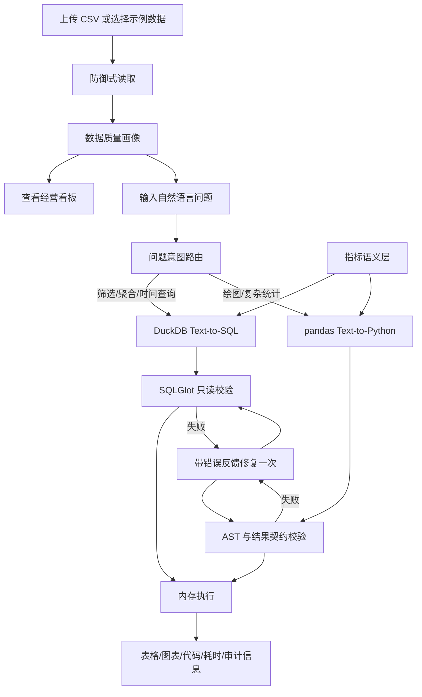

# CSV Data Agent 产品介绍

> 一套面向 CSV 数据分析场景的本地、可审计、可量化评测的自然语言分析助手。

[项目仓库](https://github.com/233xiaoxiaolzj-boop/csv-data-agent) · [架构设计](ARCHITECTURE.md) · [业务分析案例](BUSINESS_ANALYSIS.md) · [安全模型](SECURITY.md)


## 1. 一句话介绍

CSV Data Agent 允许用户上传一份 CSV 并直接用自然语言提问：系统会把常规聚合问题转换为只读 DuckDB SQL，把绘图和复杂统计转换为受控 pandas 代码，再经过语义口径注入、安全校验、自动修复和审计记录后返回表格、图表与业务结论。

它不是单纯调用大模型生成代码的聊天页面，而是一个具备以下闭环的数据分析 Agent 原型：

**数据接入 → 质量画像 → 意图路由 → 指标检索 → SQL/Python 生成 → 安全校验 → 受控执行 → 结果展示 → 全程审计 → 自动化评测**

## 2. 产品定位

### 目标用户

- 需要快速探索 CSV 的数据分析师、运营人员和业务同学
- 希望验证本地大模型数据分析能力的开发者
- 关注数据隐私，希望数据与模型均在本机运行的小型团队
- 需要学习 Text-to-SQL、数据 Agent、安全执行与评测体系的学生

### 典型场景

- 电商经营分析：销售额、销量、退货率、渠道和地区表现
- 数据质量检查：缺失值、重复行、字段基数、数值分布与高频值
- 自助问数：按时间、地区、渠道、品类进行筛选、分组与聚合
- 探索性分析：趋势图、柱状图、相关性和简单统计分析
- 分析过程复核：查看生成 SQL/代码、执行引擎、修复记录和延迟

### 当前产品边界

当前版本定位为本地作品集与受信任团队原型，支持单表 CSV。Python 执行器属于应用层防护，不是操作系统级沙箱，因此不能直接向不可信公网用户开放任意代码执行能力。

## 3. 用户痛点与产品方案

| 用户痛点 | CSV Data Agent 的解决方式 |
|---|---|
| 不会写 SQL 或 pandas，拿到 CSV 后难以快速分析 | 使用自然语言描述需求，由 Agent 生成分析逻辑 |
| “销售额”“销量”“退货率”等指标容易混淆 | 通过 `config/metrics.json` 维护可版本化指标语义层 |
| 大模型可能生成危险、不可执行或不符合业务口径的代码 | SQLGlot/AST 校验、白名单、复杂度限制和一次自动修复 |
| 只看到答案，无法判断模型做了什么 | 展示引擎、SQL/代码、生成次数、修复、回退和执行延迟 |
| Demo 看起来能运行，但缺少质量证明 | 建立 40 道分析题、12 道安全题和 55 项自动化测试 |
| CSV 编码、分隔符和规模不稳定 | 防御式加载，支持编码/分隔符识别和文件规模限制 |

## 4. 核心产品能力

### 4.1 防御式数据接入

`data_loader.py` 负责 CSV 接入，在进入分析链路前执行基础防护：

- 文件最大 50 MB、最多 100 万行
- 支持 UTF-8、GB18030 等常见编码
- 自动识别逗号、制表符、分号等分隔符
- 拒绝重复字段名与不可解析文件
- 返回清晰的中文错误信息

用户也可以点击“使用示例电商数据”，无需准备文件即可体验全部能力。

### 4.2 数据质量画像

`data_profile.py` 使用确定性代码生成数据概览，包括：

- 行数、列数和内存占用
- 缺失值与缺失率
- 重复行数量
- 字段类型与唯一值数量
- 数值字段描述性统计
- 类别字段高频值

画像结果不依赖大模型，保证同一份数据能够得到稳定、可复核的质量结论。

### 4.3 双引擎智能路由

系统根据问题意图选择更合适的执行路径：

- **DuckDB SQL 路径**：筛选、分组、聚合、排序、时间查询等结构化问题
- **pandas 路径**：绘图、相关性和较复杂的开放式统计问题

路由基于透明的任务关键词，不额外调用模型，因此延迟更低，也方便在界面中强制选择引擎进行调试和对比。

### 4.4 指标语义层

`semantic_layer.py` 从 `config/metrics.json` 中检索与用户问题相关的指标定义，并只向模型注入当前数据具备所需字段的口径。

当前语义层覆盖：

- 订单数与销量
- 原价销售额、折后销售额与回款销售额
- 退货订单数与退货率
- 平均物流时效与平均折扣率

这种设计把业务规则与 Prompt、应用代码解耦，降低“销量被当成金额”“退货率除以销量”等口径错误。

### 4.5 Text-to-SQL 分析

`sql_agent.py` 负责常规问数链路：

1. Ollama 生成一条 DuckDB SQL。
2. SQLGlot 解析并检查抽象语法树。
3. 只允许单条 `SELECT`，且只能访问内存表 `source_data`。
4. 拒绝外部 CSV、JSON、Parquet、HTTP 和数据库扫描函数。
5. 查询未设置行数限制时自动追加 `LIMIT 200`。
6. 在 DuckDB 内存连接中执行，返回结果后关闭连接。


### 4.6 Text-to-Python 分析

`agent.py` 与 `executor.py` 共同负责 pandas 分析链路：

1. 将字段信息、原始问题和相关指标口径发送给本地模型。
2. 提取模型生成的 pandas/Matplotlib 代码。
3. 使用 Python AST 拒绝导入、循环、函数、类、文件、网络、动态执行和阻塞式绘图。
4. 检查代码长度、节点数量、危险名称、危险属性和结果契约。
5. 在仅暴露 DataFrame 副本、pandas、NumPy、Matplotlib 与有限内置函数的命名空间执行。
6. 首轮失败时携带原问题、业务口径和校验错误自动修复一次。

对于明确的常见图表需求，系统还提供受信任模板作为确定性回退，减少小模型偶发格式错误。

### 4.7 经营分析看板

`business_analysis.py` 不依赖模型，直接通过确定性代码计算经营 KPI、维度表与业务观察。

系统明确区分三个容易混淆的金额口径：

```text
原价销售额 = units × unit_price
折后销售额 = 原价销售额 × (1 - discount_rate)
回款销售额 = 折后销售额 × (1 - returned)
```

看板展示：

- 订单数、销量、原价/折后/回款销售额
- 退货率、回款客单价和金额折损
- 月度销售趋势
- 地区、渠道和品类表现
- 基于现有字段生成的业务观察与下钻建议

## 5. 产品使用流程



## 6. 业务演示案例

项目提供由固定随机种子生成的两年电商订单数据，共 5,164 笔订单。该数据只用于功能验证和作品集展示，不代表真实企业经营情况。

### 核心 KPI

| 指标 | 结果 |
|---|---:|
| 订单数 | 5,164 |
| 销量 | 33,553 件 |
| 原价销售额 | ¥5,423,833.93 |
| 折后销售额 | ¥5,095,916.23 |
| 回款销售额 | ¥4,919,178.65 |
| 退货率 | 3.51% |
| 回款客单价 | ¥952.59 |
| 折扣与退货金额折损 | 9.30% |

### 示例发现

- North 地区回款销售额最高，占整体 25.3%。
- Direct 渠道回款销售额最高，Social 渠道退货率最高。
- Electronics 品类回款销售额最高，Beauty 品类退货率最高。
- 2024-07 为回款销售额峰值月份。
- 折扣与退货合计造成 9.3% 的原价金额折损。

完整分析、口径解释与行动建议见 [BUSINESS_ANALYSIS.md](BUSINESS_ANALYSIS.md)。

## 7. 可审计与可解释设计

每次分析不仅返回结果，还保留以下信息：

- 实际使用的 SQL 或 Python 引擎
- 模型生成的 SQL/代码
- 生成尝试次数
- 是否触发自动修复
- 是否触发可信公式或图表模板回退
- 模型生成延迟与实际查询/执行耗时
- 表格、标量或 Matplotlib Figure 结果

这让使用者能够区分“模型给出的答案”和“系统实际执行的分析逻辑”，便于复核、调试和回归。

## 8. 质量与评测结果

固定评测环境为 Python 3.11、Ollama `qwen2.5-coder:7b`、RTX 4060 Laptop GPU 8 GB 和 5,164 行示例数据。

| 质量指标 | 已验证结果 |
|---|---:|
| 分析任务通过率 | 40/40（100%） |
| 首轮直接通过率 | 92.5% |
| 安全规则通过率 | 12/12（100%） |
| 平均生成延迟 | 1.08 s |
| P95 生成延迟 | 2.87 s |
| 自动化测试 | 55 passed |
| 代码覆盖率 | 79.7% |
| CI 环境 | Python 3.10 / 3.12 |
| 容器验证 | Docker build passed |

> 上述 100% 只代表仓库内固定数据、固定 40 题和指定模型的评测结果，不等同于开放问题或其他数据集上的通用准确率。

评测程序会保存逐题问题、参考答案、生成代码、执行结果、修复和失败原因，报告位于 `benchmark_results/`。

## 9. 安全模型

### 已实施控制

**SQL 路径**

- SQLGlot AST 校验
- 单语句、`SELECT-only`
- 内存表白名单
- 外部读取函数拦截
- 自动结果行数限制
- DuckDB 内存连接用后关闭

**Python 路径**

- AST 语法节点白名单/黑名单校验
- 文件、网络、导入、循环、反射和动态执行限制
- 代码长度、节点数量与超大常量限制
- 受限内置函数和 DataFrame 副本
- 结果变量和结果类型契约

**容器配置**

- 非 root 用户
- 只读文件系统
- 丢弃 Linux capabilities
- `no-new-privileges`
- CPU、内存、PID 和临时目录限制
- Streamlit 健康检查

### 明确不保证的边界

AST 校验不能证明任意 Python 代码绝对安全。生产级公网部署应将每次 Python 执行放入独立容器或微虚拟机，并强制无网络、只读文件系统、资源配额和超时。详细威胁模型见 [SECURITY.md](SECURITY.md)。

## 10. 技术架构

| 层次 | 技术与职责 |
|---|---|
| 交互层 | Streamlit：上传、看板、问数、图表与审计信息 |
| 模型层 | Ollama + `qwen2.5-coder:7b`：本地 SQL/Python 生成 |
| 路由层 | 透明关键词路由，可由用户强制指定引擎 |
| 语义层 | JSON 指标定义、别名、参考公式与字段依赖 |
| SQL 层 | DuckDB + SQLGlot：只读查询、AST 校验与内存执行 |
| Python 层 | pandas + NumPy + Matplotlib：统计与绘图 |
| 安全层 | Python AST、危险名称/属性、复杂度与结果契约 |
| 数据层 | 防御式 CSV 加载、质量画像和可复现示例数据 |
| 质量层 | pytest、coverage、Ruff、黄金问题评测 |
| 交付层 | Docker、Compose、GitHub Actions |

## 11. 项目目录说明

```text
csv-data-agent/
├── app.py                         # Streamlit 页面、状态管理和结果展示
├── agent.py                       # Text-to-Python、自动修复与可信回退
├── sql_agent.py                   # Text-to-SQL、SQL 校验和 DuckDB 执行
├── executor.py                    # Python AST 安全检查与受限执行
├── semantic_layer.py              # 业务指标匹配和 Prompt 上下文构建
├── prompts.py                     # SQL/Python 生成与修复提示词
├── data_loader.py                 # CSV 编码、分隔符和规模防护
├── data_profile.py                # 确定性数据质量画像
├── business_analysis.py           # 经营 KPI、维度表和业务观察
├── benchmark.py                   # 评测执行、结果对比和报告生成
├── benchmark_cases.py             # 40 道分析题与 12 道安全题
│
├── config/
│   └── metrics.json               # 指标定义、别名、公式和字段依赖
├── sample_data/
│   ├── ecommerce_sales.csv        # 5,164 行完整电商示例数据
│   └── sales.csv                  # 简化版销售示例数据
├── scripts/
│   └── generate_demo_data.py      # 固定随机种子数据生成脚本
├── benchmark_results/             # Markdown/JSON 评测与历史基线
├── docs/images/                   # 经营看板和 SQL 审计截图
├── assets/                        # 分析结果与趋势图素材
├── tests/                         # 单元、集成和安全回归测试
│
├── README.md                      # 安装、使用和项目总览
├── PRODUCT_OVERVIEW.md            # 面向用户与面试展示的产品介绍
├── BUSINESS_ANALYSIS.md           # 示例数据的业务分析报告
├── ARCHITECTURE.md                # 架构决策与技术取舍
├── SECURITY.md                    # 威胁模型、安全控制与生产边界
├── pyproject.toml                 # pytest、coverage 和 Ruff 配置
├── requirements*.txt              # 运行与开发依赖
├── Dockerfile                     # 非 root 容器镜像与健康检查
├── compose.yaml                   # 只读、资源受限的本地容器配置
├── LICENSE                        # MIT License
└── .github/workflows/ci.yml       # Python 矩阵测试与 Docker 构建
```

### 目录设计特点

- **产品、业务与技术分离**：UI、经营分析、Agent、执行器和指标配置分别维护。
- **确定性逻辑与模型逻辑分离**：质量画像和经营 KPI 不依赖模型，开放式问数才调用模型。
- **配置与代码分离**：指标口径通过 JSON 管理，便于审查、扩展和版本控制。
- **运行与证据同时交付**：源码之外保留测试、评测报告、截图、架构和安全文档。

## 12. 快速开始

### 本地运行

```bash
ollama pull qwen2.5-coder:7b
python -m venv .venv

# Windows
.venv\Scripts\activate

# macOS / Linux
source .venv/bin/activate

python -m pip install -r requirements.txt
streamlit run app.py
```

浏览器打开 `http://localhost:8501`，点击“使用示例电商数据”，即可查看经营看板并开始问数。

### Docker Compose

```bash
docker compose up --build
```

默认通过 `host.docker.internal:11434` 访问宿主机 Ollama。

## 13. 推荐演示问题

### 常规问数

- `各地区的回款销售额分别是多少？`
- `按渠道统计订单数、回款销售额和退货率。`
- `2024 年每个月的折后销售额是多少？`

### 图表与统计

- `按月份统计销售额并画趋势图。`
- `画出各品类回款销售额柱状图。`
- `物流天数与是否退货的相关系数是多少？`

### 数据质量

- `这份数据有多少行、多少列？`
- `各字段缺失率是多少？`
- `是否存在重复订单？`

## 14. 三分钟演示脚本

1. 点击“使用示例电商数据”，说明项目可以直接体验，也支持上传自有 CSV。
2. 展示数据质量画像，强调该部分由确定性代码计算。
3. 打开经营看板，解释原价、折后、回款销售额三个口径。
4. 输入“各地区的回款销售额分别是多少”，展示 DuckDB SQL 和审计信息。
5. 输入“按月份统计销售额并画趋势图”，展示 pandas/Matplotlib 路径。
6. 展示生成 SQL/代码、修复次数、回退状态和延迟。
7. 最后介绍 40+12 评测、55 项测试、安全边界与 Docker/CI。

## 15. 产品差异化

相较于普通的“上传 CSV + 调用大模型”Demo，本项目更关注：

1. **业务口径**：指标语义层明确“算什么”。
2. **执行安全**：双引擎分别采用 SQL AST 与 Python AST 控制“允许做什么”。
3. **过程审计**：完整展示“模型生成了什么、系统执行了什么”。
4. **确定性回退**：常见业务公式和图表不完全依赖模型临场发挥。
5. **量化质量**：用固定问题、标准答案、安全题和 CI 证明“当前版本做到什么程度”。
6. **工程交付**：源码、测试、容器、评测、截图、架构和安全文档形成完整作品集。

## 16. 已知限制与路线图

### 已知限制

- 当前只支持单表 CSV，尚未覆盖多表关联和数据血缘。
- 关键词路由透明稳定，但对隐含统计意图的识别能力有限。
- 当前评测主要覆盖 Python 结果链路，SQL 与 Python 的同题对照仍可继续完善。
- Python 执行发生在应用进程内，不能替代系统级沙箱。
- 示例数据缺少成本、毛利、用户、营销费用和真实退货原因。

### 后续规划

- 支持 Parquet 与多表星型模型
- 为 SQL/Python 建立同题准确率和延迟对照
- 增加会话追问、歧义澄清与结果合理性校验
- 增加指标血缘、维度权限和查询缓存
- 使用一次一容器或微虚拟机执行 Python
- 引入真实匿名业务数据与更完整的经营指标体系

## 17. 面向面试官的 30 秒介绍

> CSV Data Agent 是我独立完成的本地数据分析助手。它会把常规问数路由到经过 SQLGlot 只读校验的 DuckDB SQL，把图表和复杂统计路由到经过 AST 安全检查的 pandas 代码。为了降低模型对业务指标的误解，我把销量、三种销售额和退货率等口径维护在 JSON 语义层中，并在界面展示生成代码、修复、回退和延迟。项目使用固定的 5,164 行电商数据完成 40 道分析题和 12 道安全题评测，当前固定集结果为 40/40，另有 55 项 pytest、79.7% 覆盖率、GitHub Actions 和 Docker 构建验证。

---

CSV Data Agent 当前以学习、作品集展示和受信任本地分析为目标。所有示例经营结论均来自模拟数据，正式业务决策前必须结合真实口径、权限与数据治理流程进一步验证。
