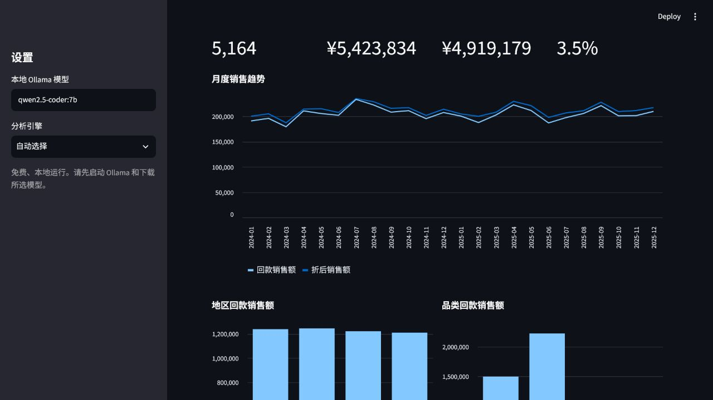
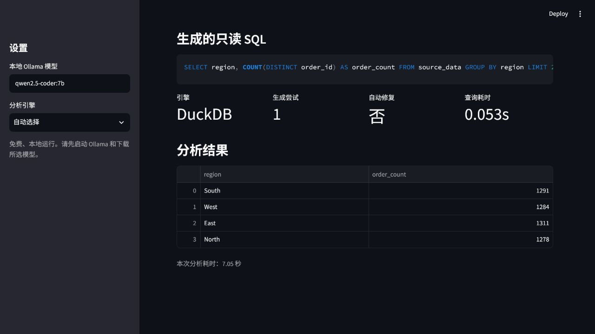
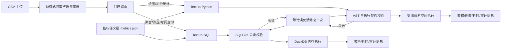

# CSV Data Agent：本地可审计的数据分析助手

面向真实 CSV 分析场景的自然语言数据助手。系统自动识别问题类型：常规聚合优先生成 DuckDB 只读 SQL，绘图与复杂统计走受控 pandas；所有模型产物在执行前经过规则校验，并保留生成、修复、回退、执行与延迟信息。

> 作品集定位：不是“套壳聊天页面”，而是一套可量化评测、可复现数据、业务指标口径和安全边界明确的数据分析 Agent 原型。



## 核心能力

- 双引擎路由：常规查询使用 DuckDB SQL，图表/复杂统计使用 pandas + Matplotlib
- 指标语义层：`config/metrics.json` 统一维护销量、销售额、订单数、退货率等业务口径
- SQL 防护：SQLGlot AST 校验、单语句、SELECT-only、表白名单、外部读取函数拦截、自动 LIMIT
- Python 防护：AST 节点限制、危险名称/属性拦截、受限内置函数、代码长度与复杂度限制
- 自动修复：首轮代码或 SQL 不符合契约时，携带原问题、业务口径和校验错误重试一次
- 数据质量画像：行列数、缺失、重复、内存、字段基数、数值统计和高频值
- 经营分析看板：区分原价、折后与退货后回款销售额，展示月度、地区和品类表现
- 防御式 CSV 读取：50 MB / 100 万行上限，UTF-8/GB18030、分隔符识别和异常提示
- 分层评测：40 道分析题 + 12 道安全题，输出 Markdown 与 JSON 可审计报告
- 工程化：pytest、coverage、Ruff、GitHub Actions Python 3.10/3.12 矩阵与 Docker 构建

## 已验证结果

本地使用 `qwen2.5-coder:7b`、5,164 行电商数据运行完整 Python 分析基准：

| 指标 | 结果 |
|---|---:|
| 分析任务通过率 | 40/40（100.0%） |
| 首轮直接通过率 | 92.5% |
| 安全规则通过率 | 12/12（100%） |
| 平均延迟 | 1.08 s |
| P95 延迟 | 2.87 s |
| 自动化测试 | 55 passed，包含 DuckDB / SQLGlot 路径 |

评测环境为 Python 3.11、Ollama `qwen2.5-coder:7b` 和 RTX 4060 Laptop GPU 8 GB。结果只代表仓库内固定数据、固定问题与指定模型，不等同于通用准确率。逐题问题、生成代码、修复和回退记录均保留在 [完整评测报告](benchmark_results/20260719-211254-qwen2.5-coder-7b.md) 中；仓库同时保留早期 38/40 基线，便于核对改进过程。

## 业务分析演示

示例电商数据不仅用于验证 Agent，还提供确定性经营分析层。项目明确区分三种容易混淆的金额口径：

- 原价销售额：`units × unit_price`
- 折后销售额：原价销售额乘以 `1 - discount_rate`
- 回款销售额：折后销售额进一步剔除 `returned = 1` 的订单

在固定种子的 5,164 笔模拟订单中，原价销售额为 542.38 万元，回款销售额为 491.92 万元，折扣与退货合计造成 9.3% 的金额折损。North 地区回款销售额最高，Social 渠道退货率最高。完整口径、维度表和可执行建议见 [BUSINESS_ANALYSIS.md](BUSINESS_ANALYSIS.md)。所有结论均来自模拟数据，不代表真实企业经营结果。

## Agent 审计展示

常规聚合问题自动路由到只读 DuckDB SQL。界面同时展示生成 SQL、执行引擎、生成尝试、自动修复、查询耗时和结果表，便于复核模型行为。



## 架构



更完整的设计取舍见 [ARCHITECTURE.md](ARCHITECTURE.md)，威胁模型和生产边界见 [SECURITY.md](SECURITY.md)。

## 快速开始

### 1. 准备模型

安装 [Ollama](https://ollama.com)，然后执行：

```bash
ollama pull qwen2.5-coder:7b
```

### 2. 安装与启动

```bash
python -m venv .venv
# Windows: .venv\Scripts\activate
# macOS/Linux: source .venv/bin/activate
python -m pip install -r requirements.txt
streamlit run app.py
```

上传自己的 CSV，或点击页面中的“使用示例电商数据”一键体验经营看板与 Agent。推荐问题：

- `各地区销售额分别是多少？`
- `按月份统计销售额并画趋势图，销售额等于 units × unit_price。`
- `各渠道退货率和平均物流时效分别是多少？`
- `物流天数与是否退货的相关系数是多少？`

## 评测与测试

快速冒烟：

```bash
python benchmark.py --suite quick
```

完整评测会执行 40 道分析题、12 道安全题并生成 Markdown/JSON 报告：

```bash
python benchmark.py --suite full \
  --csv sample_data/ecommerce_sales.csv \
  --model qwen2.5-coder:7b
```

工程检查：

```bash
python -m pip install -r requirements-dev.txt
ruff check .
pytest --cov --cov-report=term-missing
```

## 数据与指标口径

`scripts/generate_demo_data.py` 使用固定随机种子生成两年、5,164 行电商订单数据，包含地区、渠道、品类、销量、价格、折扣、退货和物流时效。指标不写死在提示词中，而是维护在 `config/metrics.json`：

```json
{
  "name": "return_rate",
  "label": "退货率",
  "definition": "returned 是订单级 0/1 标记，退货率为 returned 的平均值",
  "formula": "df['returned'].mean()"
}
```

语义层按用户问题只检索相关口径，避免无关指标污染小模型上下文。

## 项目结构

```text
csv-data-agent/
├── app.py                    # Streamlit UI 与双引擎展示
├── business_analysis.py      # 确定性经营 KPI、维度表和业务观察
├── agent.py                  # Text-to-Python、修复和公式回退
├── sql_agent.py              # Text-to-SQL、SQLGlot 校验与 DuckDB 执行
├── semantic_layer.py         # 业务指标检索
├── executor.py               # Python AST 校验与受限执行
├── data_loader.py            # CSV 编码/分隔符/规模防护
├── data_profile.py           # 确定性数据质量画像
├── benchmark.py              # 评测运行、指标汇总和报告输出
├── benchmark_cases.py        # 40+12 版本化黄金用例
├── config/metrics.json       # 外部可配置指标口径
├── BUSINESS_ANALYSIS.md      # 示例数据经营分析与行动建议
├── sample_data/              # 可复现示例数据
├── scripts/                  # 数据生成脚本
├── tests/                    # 单元与安全回归测试
└── .github/workflows/ci.yml  # CI 与 Docker 构建
```

## 安全说明

SQL 路径比任意 Python 更适合常规分析，但当前 Python 执行器仍然只是应用层防护，不是操作系统级沙箱。不要直接用于执行不可信公网用户生成的代码。生产环境应把每次 Python 执行放入独立容器或微虚拟机，并限制网络、只读文件系统、CPU、内存、PID 与超时。

## 下一步

- 将 SQL 评测纳入与 Python 相同的 40 题对照，并记录两条链路的准确率/延迟差异
- 接入 Parquet 和多表星型模型，展示事实表、维度表、指标与数据血缘
- 使用一次一容器的 Docker sandbox 替换进程内 Python 执行
- 增加会话级追问、歧义澄清和结果合理性校验

## License

MIT
