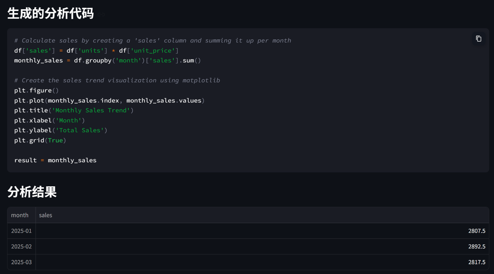
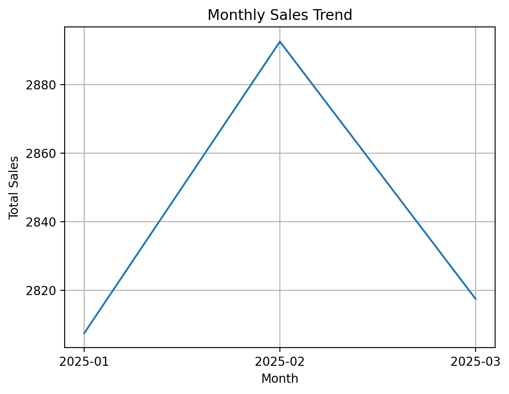

# CSV 智能数据分析 Agent

一个轻量的本地数据分析 Agent：上传 CSV 后，用自然语言提出问题，由本地 Ollama 模型生成 pandas 分析代码，并在受限环境中执行、展示表格和图表。

## 功能

- CSV 上传、预览和字段类型识别
- 使用本地 Ollama 模型，无需云端 API Key
- 自动生成 pandas / matplotlib 分析代码并展示，结果可审计
- AST 安全校验，阻止导入、文件读写、网络访问及危险内置函数
- 对 `units × unit_price` 销售额分析提供公式守卫：先逐行计算销售额，再聚合，避免“销量总和 × 平均单价”的常见错误
- 内含样例销售数据和单元测试

## 效果展示

自然语言问题：`按月份统计总销售额（units × unit_price），并画出趋势图。`





## 快速开始

1. 安装 [Ollama](https://ollama.com)，并下载本地模型：

   ```bash
   ollama run deepseek-r1:7b
   ```

2. 安装依赖并启动：

   ```bash
   pip install -r requirements.txt
   streamlit run app.py
   ```

3. 上传 `sample_data/sales.csv`，然后提出分析问题。

## 架构

```text
CSV + 用户问题 → 本地 LLM 生成代码 → 安全/公式校验 → 受限执行 → 表格与图表
```

## 测试

```bash
pip install -r requirements-dev.txt
pytest
```

## 安全说明

当前版本通过 AST 拦截明显危险语法，适合本地教学和作品集展示。生产环境应使用 Docker 或微虚拟机进一步隔离执行环境，并增加超时、内存和网络限制。

## 后续迭代

1. 增加“执行失败后自动修复一次”的 Agent 循环。
2. 建立数据分析任务集，记录成功率、延迟与资源消耗。
3. 支持更多本地模型与 Docker 沙箱。
